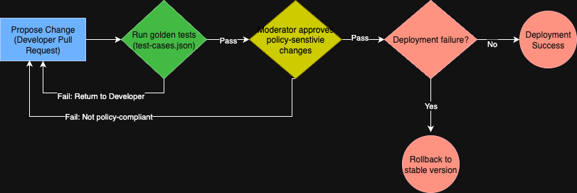

This document explains how the chatbot prompt will be updated and maintained as marketplace features evolve. The process emphasizes safety, reliability, and accountability, combining automated pipelines with human oversight.

---

## 1. Version Control Integration
- All chatbot prompt updates are stored in **GitHub**.
- Developers create a **feature branch** for changes and submit a **pull request (PR)**.
- Every change is tracked with commit history, ensuring rollback to earlier versions if needed.
- Using Git ensures that multiple contributors can collaborate without overwriting each other’s work.

## 2. Automated Testing Pipeline
- Each PR automatically triggers a **CI/CD pipeline** (e.g., GitHub Actions).
- The pipeline executes all **golden test cases** from `test-cases.json`.
- Tests check whether chatbot responses include the **expected elements** and meet success criteria.
- If any test fails, the pipeline blocks the PR from being merged.

## 3. Deployment Workflow for Prompt Updates
- Once a PR is **approved and all tests pass**, it is merged into the `main` branch.

## 4. Rollback Capabilities for Failed Updates
- If issues are detected post-deployment (failing health checks, unsafe responses, or user complaints), the system triggers a **rollback**.
- Rollback mechanism:
  - Automatically revert to the **last stable commit** in Git.
  - Redeploy the stable version of the prompt.

## 5. Change Approval Process for Policy Updates
- Policy-sensitive changes (e.g., new prohibited items, escalation rules, safety guidelines) require **human approval** before deployment.
- Moderator or policy owner reviews the PR, checks for compliance, and signs off.
- Only after approval can the PR move forward to deployment.

## Workflow Diagram Design

- **Blue rectangle** = Developer action 
- **Green rectangle** = Automated step 
- **Yellow diamond** = Decision point
- **Red rectangle** = Rollback step.

  ```markdown
  

